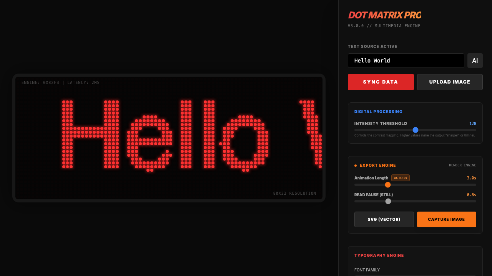

# Dot Point Matrix

A retro LED dot-matrix display simulator. Converts text and images into pixelated LED matrix outputs with real-time animation effects, custom typography, and export to SVG/GIF.

## Run Locally

**Prerequisites:**  Node.js, pnpm

1. Install dependencies:
   `pnpm install`
2. Copy `.env.example` to `.env.local` and set your `GEMINI_API_KEY`:
   `cp .env.example .env.local`
3. Run the app:
   `pnpm run dev`
4. Open [http://localhost:3010](http://localhost:3010) in your browser

  
  
<em>Dot Matrix Pro 應用介面</em>

